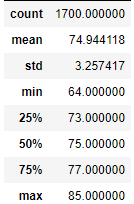
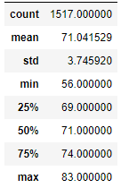

# Oahu Hawaii Climate Analysis
## Purpose
The purpose of this analysis is to review temperature trend information for Oahu, Hawaii to determine if the surf and ice cream shop business is sustainable year round.

## Resources
- Source Data:  hawaii.sqlite
- Analysis Notebook:  [SurfsUp_Challenge.ipynb](./SurfsUp_Challenge.ipynb)
- Challenge Tools Used:  Jupyter Notebook, pandas, sqlalchemy, sqlite
- Modules Tools Used:  Jupyter Notebook, pandas, sqlalchemy, sqlite, Flask

## Results
Three key takeaways from the June and December temperature data:
- The average temperature for both months is above 70 °F, which is an ideal range for people
- The standard deviation for both months is very small at just above 3 °F, which means that temperatures are very consistent year over year for both months; also likely indicates that temperatures are consistent throughout the year
- For June the interquartile range is 73-77 °F, which also indicates that temperatures are consistently in the mid-70 °F range throughout the month year over year; though December temperatures are slightly lower the IQR is still 69-74 °F.

The table below provides the temperature statistics for June for all years available in the database.

 

The table below provides the temperature statistics for June for all years available in the database.

 

## Summary
The temperature statistics provided above demonstrate that Oahu, Hawaii temperatures are well suited to human activity both in June and December and that those temperatures are very consistent year over year.  June and December are also very similar in terms of temperatures, which may indicate that temperatures are consistently in the 70+ °F range throughout the year.

I would do the following additional queries to gather more weather data for both months:
- Analyze day time temperatures since people are much more likely to be surfing and eating ice cream when the sun is shining
- Gather precipitation data to see if one month has more rain than the other